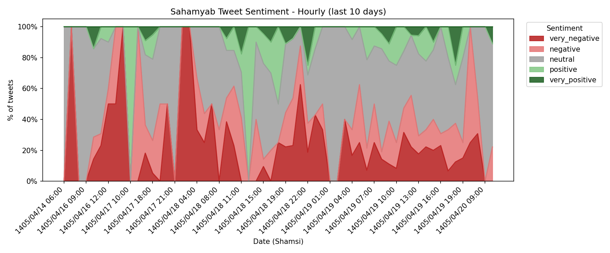
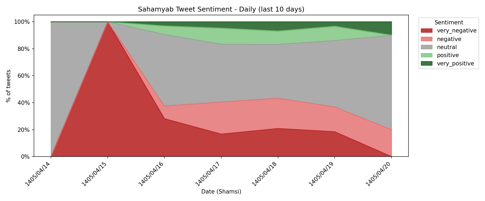

# Sahamyab Twitter Sentiment Pipeline

An end-to-end data pipeline that collects stock-market-related posts from **Sahamyab** — an Iranian financial platform that mirrors posts from X (Twitter) about the stock market — stores them, cleans them, and runs sentiment analysis on them. Everything is scheduled and managed by **Apache Airflow**.

The goal of this project was to practice building a real data pipeline — not just writing scripts, but also handling scheduling, failures, and recovery like a real system needs.

## What it does

1. **Extract** — Every 15–20 minutes, fetch new posts from the Sahamyab public API (posts originally from X/Twitter, mirrored by Sahamyab).
2. **Load (raw)** — Store the raw JSON response in **MongoDB**, so we always keep the original data untouched.
3. **Transform** — Clean and structure the tweets (parse dates, normalize fields).
4. **Load (analytics)** — Insert the cleaned data into **ClickHouse**, a columnar database built for fast analytical queries.
5. **Sentiment Analysis** — Every hour, run unlabeled tweets through **NEXARA**, a Persian financial-sentiment BERT model, and store the sentiment label/score back in ClickHouse.

```
Sahamyab API → MongoDB (raw) → ClickHouse (clean) → NEXARA sentiment model → ClickHouse (labeled)
                                        ↑
                                   Apache Airflow
                              (orchestrates every step)
```

## Why this schedule?

- **ETL every 15–20 min**: This is social data about stock market chatter. Freshness matters — the whole point of tracking sentiment on a trading platform is to catch shifts early, so a slow schedule (like once a day) would make the data much less useful.
- **Sentiment analysis hourly**: Loading the ML model has some fixed cost, so running inference in hourly batches (instead of on every single tweet) is a good balance between freshness and efficiency.

## Tech stack

| Tool | Version | Role |
|---|---|---|
| Apache Airflow | 2.10.5 (CeleryExecutor) | Workflow orchestration, scheduling, retries |
| MongoDB | 7.0 | Raw data lake (unstructured JSON) |
| ClickHouse | 24.3 | Analytical database (structured, fast queries) |
| PostgreSQL | 15 | Airflow metadata database |
| Redis | 7.2 | Celery broker (task queue for Airflow workers) |
| PyTorch | 2.2.2 | Runs the sentiment model |
| Transformers | 4.38.2 | Loads and runs the NEXARA BERT model |
| Docker Compose | — | Runs all services together locally |

Extra tools for browsing data during development:
- **mongo-express** (port 8081) — web UI for MongoDB
- **ch-ui** (port 5521) — web UI for ClickHouse

## Infrastructure

All services run in Docker containers, connected on one Docker network (`data_network`):

```
airflow-webserver  (8080)   → Airflow UI
airflow-scheduler           → schedules and triggers DAGs
airflow-worker              → runs the actual tasks (Celery worker)
postgres                    → Airflow's own metadata database
redis          (6379)       → task queue between scheduler and worker
mongo          (27017)      → raw data lake
mongo-express  (8081)       → MongoDB web UI
clickhouse     (8123, 9000) → analytics database
ch-ui          (5521)       → ClickHouse web UI
```

The Airflow image is built from a small custom `Dockerfile` on top of the official `apache/airflow:2.10.5` image, just to install the extra Python packages needed (`requirements.txt`): `pymongo`, `clickhouse-driver`, `requests`, `pandas`, `python-dateutil`, `torch`, `transformers`.

## Data model

### MongoDB — `analytics.raw_tweets`

This is the raw data lake. MongoDB has no fixed schema, so each document just keeps the full API response as-is. This means we never lose data, even if we change how we clean it later.

Real fields, checked directly on the running database:

```json
{
  "_id": ObjectId,
  "timestamp": "2026-07-06T12:00:00Z",
  "source": "sahamyab_twitter",
  "raw_data": { "...full original API response..." }
}
```

### ClickHouse — `analytics.tweets`

This is the clean, structured table used for analysis. Real DDL, taken directly from the running database with `SHOW CREATE TABLE`:

```sql
CREATE TABLE analytics.tweets
(
    `id` String,
    `send_time` DateTime,
    `send_time_persian` String,
    `sender_name` String,
    `sender_username` String,
    `content` String,
    `type` String,
    `comment_count` UInt32,
    `has_parent` UInt8,
    `parent_id` String,
    `parent_content` String,
    `parent_sender_name` String,
    `extracted_at` DateTime DEFAULT now(),
    `event_label` String DEFAULT '',
    `sentiment_score` Float32 DEFAULT 0.,
    `sentiment_label` String DEFAULT ''
)
ENGINE = ReplacingMergeTree(extracted_at)
PARTITION BY toYYYYMM(send_time)
ORDER BY (send_time, id)
SETTINGS index_granularity = 8192
```

**Why these choices matter (good talking points for interviews):**
- `ReplacingMergeTree(extracted_at)` — if the same tweet is inserted twice, ClickHouse keeps only the newest version (based on `extracted_at`). This protects against duplicate inserts.
- `PARTITION BY toYYYYMM(send_time)` — data is split into monthly chunks. This makes queries that filter by date range much faster, and makes it easy to drop old months if needed.
- `ORDER BY (send_time, id)` — this is the sort key ClickHouse uses on disk. Since most queries filter or sort by time, this keeps time-based queries fast.

> Note: `sentiment_score` and `sentiment_label` have empty/zero defaults, since sentiment analysis happens later, in a separate DAG, after the row already exists.

### ClickHouse — `analytics.tweets_daily_stats` (materialized view)

To avoid running heavy aggregation queries on the full `tweets` table every time, there is a materialized view that keeps a running daily summary automatically, using ClickHouse's `SummingMergeTree` engine:

```sql
CREATE MATERIALIZED VIEW analytics.tweets_daily_stats
ENGINE = SummingMergeTree()
ORDER BY (date, type)
AS
SELECT
    toDate(send_time) AS date,
    type,
    count() AS tweet_count,
    sum(comment_count) AS total_comments,
    countDistinct(sender_username) AS unique_authors
FROM analytics.tweets
GROUP BY date, type;
```

Every time a new tweet is inserted into `analytics.tweets`, ClickHouse updates this view automatically — no extra job needed. Reading `tweets_daily_stats` for a dashboard is much faster than re-counting millions of rows in the main table every time.

## Airflow DAGs

- **`sahamyab_twitter_etl`** — extract → store raw → transform → load → verify. Runs every 15–20 minutes.
- **`sahamyab_sentiment_analysis`** — checks for unlabeled tweets, runs NEXARA sentiment model in batches, writes results back, shows a sentiment distribution summary. Runs hourly.

## Results

Sentiment breakdown of collected tweets, computed directly from `analytics.tweets` (no separate rollup table — this is calculated fresh each time the chart script runs, so it is never stale):

**Hourly** (last 10 days):

[View the interactive version](https://YOUR_GITHUB_USERNAME.github.io/YOUR_REPO_NAME/sentiment_chart_hourly.html) *(set this up once — see below)*

**Daily** (last 10 days):

[View the interactive version](https://YOUR_GITHUB_USERNAME.github.io/YOUR_REPO_NAME/sentiment_chart_daily.html) *(set this up once — see below)*

Dates are shown in the Persian (Shamsi) calendar, since the data is about the Iranian stock market.

### How to generate these charts yourself

This runs on your own machine, not inside Airflow, since ClickHouse's port is already exposed to `localhost` by `docker-compose.yml`.

```bash
pip install -r requirements-dev.txt
python scripts/generate_sentiment_chart.py
```

This produces four files:
- `sentiment_chart_hourly.png` / `docs/sentiment_chart_hourly.html`
- `sentiment_chart_daily.png` / `docs/sentiment_chart_daily.html`

Only the last 10 days are shown by default (change `DAYS_TO_SHOW` at the top of the script if you want a different window).

## Engineering challenges

Running this pipeline for real (not just once) caused several real problems — the ML model reloading too often, tasks freezing when the laptop went to sleep, and a tricky clock-drift bug. Each problem, its cause, and its fix are written down in **[INCIDENTS.md](./INCIDENTS.md)**.

## Running locally

**1. Build the custom Airflow image** (this installs the Python packages from `requirements.txt` on top of the base `apache/airflow:2.10.5` image):
```bash
docker build -t my-airflow-with-deps:latest .
```

**2. Set up your environment file** (copy the example and fill in real values):
```bash
cp .env.example .env
```
Then open `.env` and fill in real passwords. Generate a real Airflow Fernet key with:
```bash
python -c "from cryptography.fernet import Fernet; print(Fernet.generate_key().decode())"
```

**3. Start all containers:**

```bash
docker compose up -d
```

**4. Initialize ClickHouse.**
ClickHouse is *supposed* to run `clickhouse-init.sql` by itself on first startup (via `docker-entrypoint-initdb.d`), but in practice this does not always happen. Run it manually to be sure:

```bash
# Copy the SQL file into the container
docker cp clickhouse-init.sql clickhouse:/clickhouse-init.sql

# Run it
docker compose exec clickhouse clickhouse-client --user admin --password YOUR_CLICKHOUSE_PASSWORD --queries-file /clickhouse-init.sql
```
Check it worked:
```bash
docker compose exec clickhouse clickhouse-client --user admin --password YOUR_CLICKHOUSE_PASSWORD --query "SHOW TABLES FROM analytics"
```
You should see `tweets` and `tweets_daily_stats`.

**5. Initialize the Airflow database and create the admin user.**
The `airflow-init` service is supposed to do this automatically, but if the Airflow UI login does not work, run these manually:

```bash
docker compose exec airflow-webserver airflow db init

docker compose exec airflow-webserver airflow users create \
  --username admin \
  --firstname YOUR_FIRST_NAME \
  --lastname YOUR_LAST_NAME \
  --role Admin \
  --email your_email@example.com \
  --password YOUR_AIRFLOW_WWW_USER_PASSWORD
```
If the `admin` user already exists but the password does not match your `.env`, use `reset-password` instead of `create`:
```bash
docker compose exec airflow-webserver airflow users reset-password --username admin --password YOUR_AIRFLOW_WWW_USER_PASSWORD
```

**6. Open the UIs:**

| Service | URL |
|---|---|
| Airflow UI | http://localhost:8080 |
| ClickHouse UI (ch-ui) | http://localhost:5521 |
| Mongo Express | http://localhost:8081 |

> The sentiment model (~600MB) is **not** included in this repo, and should not be — GitHub blocks files over 100MB anyway. It downloads automatically from Hugging Face (`MTE313/NEXARA_model`) the first time the sentiment DAG runs.

## Security

This project reads all passwords from environment variables (see `.env.example`), not from hardcoded values in the code. A few things worth knowing:

- `.env` is in `.gitignore` and is never committed — only `.env.example` (placeholder values) is in the repo.
- The Airflow Fernet key must be generated fresh for your own setup (see step 1 above) — never reuse a key that has been shared or written down anywhere public.
- Before your first `git commit`, always run `git status` and check that `.env` does not appear in the list of files to be committed.

## Possible improvements

- Add data quality checks (for example with Great Expectations) between the ETL step and the sentiment step.
- Add a Grafana or Metabase dashboard on top of ClickHouse to show sentiment trends over time — the `tweets_daily_stats` materialized view is already a good starting point for this.
- Run the sentiment model as a small separate service (for example a FastAPI app), instead of loading it inside the Airflow worker process. This is a performance idea, not a change to what the pipeline does — sentiment analysis stays exactly as it is, this would just let the model stay loaded in memory across DAG runs instead of loading once per run.
- Add a second model step to tag which industry or sector each tweet is about (banking, automotive, steel, petrochemical, technology, etc.), using an LLM with a fixed list of categories (zero-shot classification, no training data needed). This would turn "sentiment on the market" into "sentiment by industry," which is much more useful for real analysis — for example, seeing that banking sentiment dropped while tech sentiment stayed flat, instead of one mixed number for everything.
